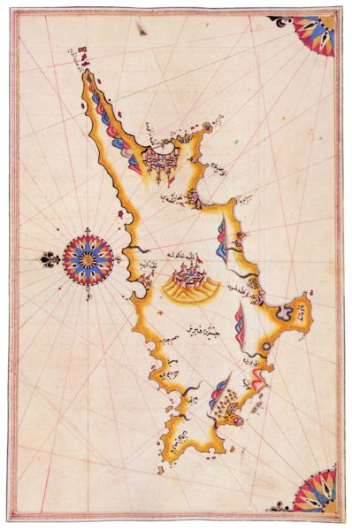

# Interreligiöse Begegnungen und Debatten auf Arabisch vom 11. bis zum 14. Jahrhundert

### Was ist der “Brief aus Zypern”?

Sommersemester 2025
Prof. Dr. Nathan Gibson

## 📈 Rückblick

## Referat

## Heutiges Lernziel

Erklären können, aus welchem historischen Kontext der Brief von Zypern kommt.

## Der Autor

- anonym
- schreibt wahrscheinlich früh im 14. Jhdt., weil der Brief an Ibn Taymiyya in 1316 und an al-Dimashqī in 1321 geschickt wurde
- gute Arabischkenntnisse und Korankenntnisse, kommt evtl. ursprünglich vom Damaskus-Gebiet, weil er Damaskus gut kennt
- evtl. Flüchtling von mamlukischen Eroberungen? 

## Der Autor

- revidiert das Werk von Paulus von Antiochien 

<https://hyperchalk.studiumdigitale.uni-frankfurt.de/25debatten9>

## Zypern im 14. Jhdt.

## Zypern im 14. Jhdt.

- geographische Lage
- Sprachen: Zypriotisches Griechisch, Zypriotisches Arabisch, Armenisch
- Hat seit 431 eigenen Erzbischof (Byzantinisch Orthodoxe) 

## Zypern im 14. Jhdt.: Exkurs

- Melkiten (Byzantinisch Orthodoxe im arabisch-sprachigen Raum, von ar. "mālik")
- Maroniten (Libanesische Kirche in der syrisch-aramäischen Tradition, integrierte auch Arabisch, später mit den Katholiken fusioniert)

## Zypern im 14. Jhdt.

- 7.-10. Jhdt. Angriffe, Streit zwischen Byzantinen und Khalifat
- 11 Jhdt. eine Base für die Kreuzzügen 
- 1191 Richard Löwenherz eroberte, verkauft den Tempelrittern
- 1194 Guido de Lusignan (frühere König von Jerusalem), Anfang "Fränkische Periode"
- Maroniten ab 12. Jhdt., Mehrheit Byzantinisch Orthodoxe

## Intentionen

- In welche Richtung revidiert unser Autor das Werk von Paulus? 
- Warum revidiert er es so? 